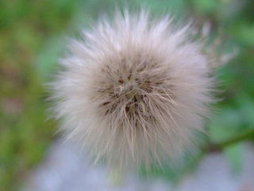

## Flower Classifier (MobileVit  Fine Tune Study)
### Dataset
----
1. **Download & unzip pictures under data directory**


```
wget http://download.tensorflow.org/example_images/flower_photos.tgz  
```
**Examples**

|  |  |  |  |  |
| ------------------------------------------ | ---------------------------------------------- | ------------------------------------------- | ------------------------------------------------ | -------------------------------------------- |
| daisy                                          | dandelion                                              |roses                                           |sunflowers                                                |tulips                                           |

2. **Split files into two folders: train and test with tools/shuflink**
```
cd data
../tools/shuflink flower_photos train test
cd ..
```


### Train
----
```
python train.py
```

Training models are saved under output directory as model.pth.


### Evaluate
----

```
python test.py
```

ACC is about 94.2% after 50 epochs trainning.


### Predict
----

**`python predict.py -h`**  

`python predict.py --input images/daisy_5794835_d15905c7c8_n.jpg`  

`Image class: 0, daisy, 1.00, images/daisy_5794835_d15905c7c8_n.jpg`  


### Requirements
----

- Python 3.9

- Pytorch 1.9.0+cu102

- Torchvision 0.10.0+cu102


### License
----

Project  is released under the [Apache 2.0 license]

